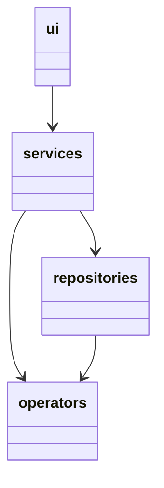
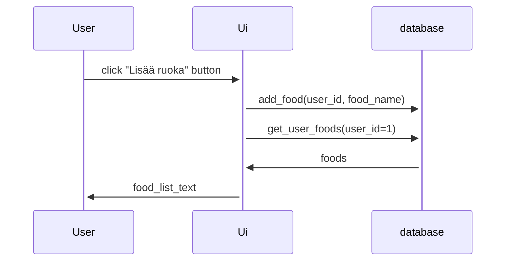

 # Arkkitehtuurikuvaus

## Rakenne

Ohjelman rakenne ei ole vielä lopullinen. Mm database jakaantuu ja siirtyy toiseen pakkaukseen.

Ohjelman koodi on jaettu neljään pakkaukseen eli hakemistoon. Ui:ssa on käyttöliittymän koodi, servicessä sovelluslogiikka, operators sisältää ohjelman tietokohteet ja repositories 

Käyttöliittymä koostuu kahdesta näkymästä. Kirjautumisnäkymä avautuu ensin. siinä voi rekisteröidä uuden käyttäjä ja kirjautua sisään. Päänäkymä avautuu onnistuneen kirjautumisen jälkeen. Molemmat ovat omia luokkia.

Tietojen tallennus tehdään tietokantaan.

## Sekvenssikaavio

