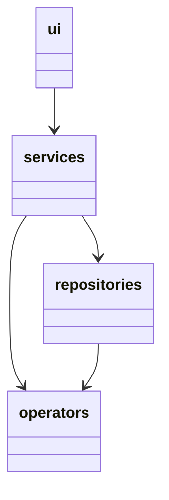
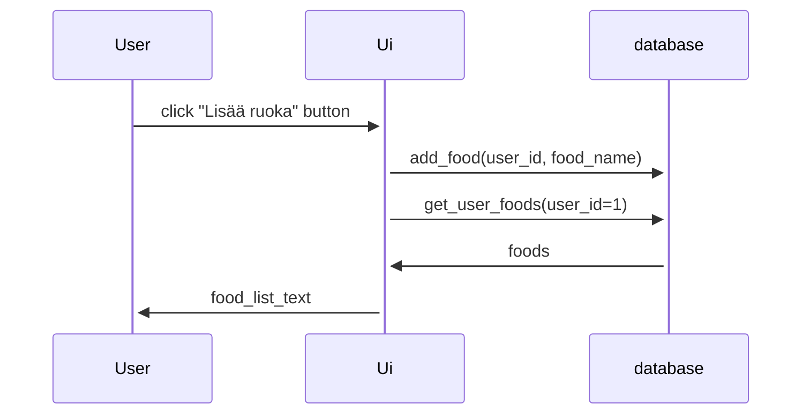

## Rakenne

```mermaid
 classDiagram
    ui --> services
    services --> operators
    services --> repositories
    repositories --> operators
```

## Sekvenssikaavio

```mermaid
sequenceDiagram
  participant User
  participant Ui
  participant database
  
  User ->> +Ui: click "Lisää ruoka" button
  Ui ->> +database: add_food(user_id, food_name)
  Ui ->> +database: get_user_foods(user_id=1)
  database ->> +Ui: foods
  Ui ->> +User: food_list_text
```
