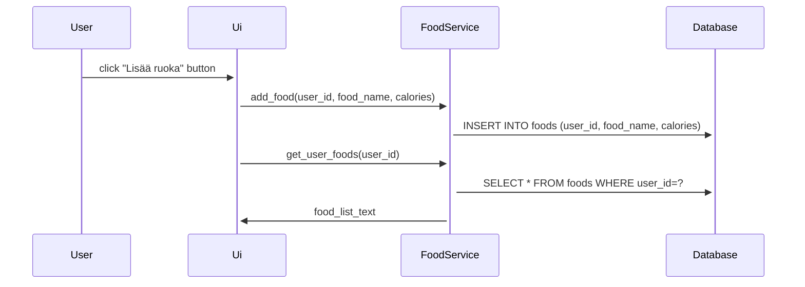

 # Arkkitehtuurikuvaus

## Rakenne

Ohjelman koodi on jaettu neljään pakkaukseen eli hakemistoon. Ui:ssa on käyttöliittymän koodi, servicessä sovelluslogiikka, operators sisältää ohjelman tietokohteet ja repositories tietojen tallennuksen.

Käyttöliittymä koostuu kahdesta näkymästä. Kirjautumisnäkymä avautuu ensin. Siinä voi rekisteröidä uuden käyttäjän ja kirjautua sisään. Päänäkymä avautuu onnistuneen kirjautumisen jälkeen. Molemmat ovat omia luokkiaan.

Tietojen tallennus tehdään tietokantaan.

## Toiminnallisuudet

Käyttäjä voi rekisteröidä itselleen käyttäjätunnuksen antamalla sovellukseen käyttäjätunnuksen ja salasanan. Käyttäjä voi kirjautua sovellukseen kirjoittamalla käyttätunnuksen ja salasanan ja painamalla Kirjaudu-painiketta. Onnistuneen kirjautumisen jälkeen kirjautumisnäkymä sulketuu ja päänäkymä avatuu. 

Päänäkymässä käyttäjä voi hakea tallentamansa ruoat näkyviin tietokannasta painamalla Näytä-painiketta. Käyttäjä voi tallentaa uusia ruokatietoja antamalla ruoan nimen ja kalorimäärän ja painamalla Lisää ruokatieto-painiketta. Ruokatiedon lisäys tuo näkyviin käyttäjälle tallennetun kokonaiskalorimäärän. Käyttäjä voi tyhjentää tallentamansa ruokatiedot painamalla Tyhjennä tallennetut ruokatiedot-painiketta. Käyttäjä voi kirjautua ulos sovelluksesta painamalla Kirjaudu ulos-painiketta. Uloskirjautumisessa päänäkymä sulkeutuu ja kirjautumisnäkymä avautuu uudelleen.

## Sekvenssikaavio

