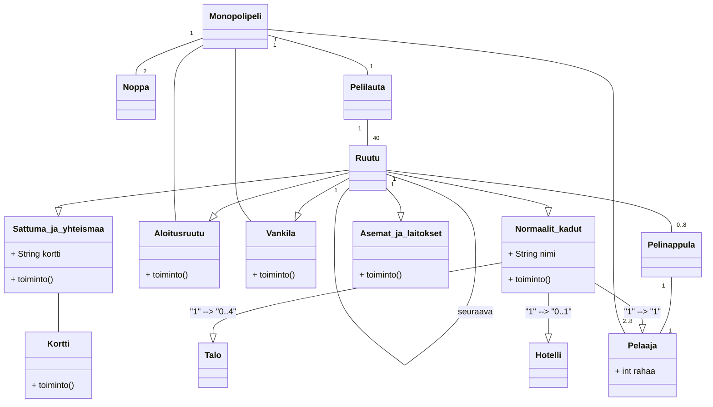

```mermaid
 classDiagram
    Monopolipeli "1" -- "2" Noppa
    Monopolipeli "1" -- "1" Pelilauta
    Pelilauta "1" -- "40" Ruutu
    Ruutu "1" -- "1" Ruutu : seuraava
    Ruutu "1" -- "0..8" Pelinappula
    Pelinappula "1" -- "1" Pelaaja
    Pelaaja "2..8" -- "1" Monopolipeli

    Ruutu --|> Aloitusruutu
    Ruutu --|> Vankila
    Ruutu --|> Sattuma_ja_yhteismaa
    Ruutu --|> Asemat_ja_laitokset
    Ruutu --|> Normaalit_kadut

    Monopolipeli -- Aloitusruutu
    Monopolipeli -- Vankila
    
    Sattuma_ja_yhteismaa -- Kortti
    Normaalit_kadut --|> Talo : "1" --> "0..4"
    Normaalit_kadut --|> Hotelli : "1" --> "0..1"
    Normaalit_kadut --|> Pelaaja : "1" --> "1"

    class Aloitusruutu {
        + toiminto()
    }

    class Vankila {
        + toiminto()
    }

    class Sattuma_ja_yhteismaa {
        + String kortti
        + toiminto()
    }
    
    class Asemat_ja_laitokset {
        + toiminto()
    }

    class Normaalit_kadut {
        + String nimi
        + toiminto()
    }

    class Pelaaja {
        + int rahaa
    }

    class Kortti {
        + toiminto()
    }

```
