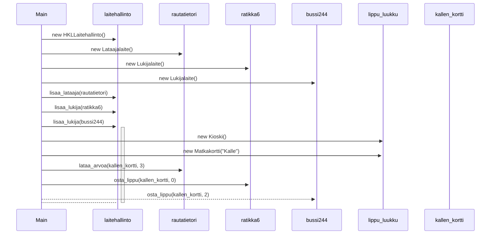

```mermaid
sequenceDiagram
  participant Main
  participant laitehallinto
  participant rautatietori
  participant ratikka6
  participant bussi244
  participant lippu_luukku
  participant kallen_kortti
  
  Main ->> +laitehallinto: new HKLLaitehallinto()
  Main ->> +rautatietori: new Lataajalaite()
  Main ->> +ratikka6: new Lukijalaite()
  Main ->> +bussi244: new Lukijalaite()
  Main ->> +laitehallinto: lisaa_lataaja(rautatietori)
  Main ->> +laitehallinto: lisaa_lukija(ratikka6)
  Main ->> +laitehallinto: lisaa_lukija(bussi244)
  Main ->> lippu_luukku: new Kioski()
  Main ->> +lippu_luukku: new Matkakortti("Kalle")
  Main ->> rautatietori: lataa_arvoa(kallen_kortti, 3)
  Main ->> ratikka6: osta_lippu(kallen_kortti, 0)
  Main -->> bussi244: osta_lippu(kallen_kortti, 2)     
  laitehallinto --> -Main: 

   

  

```
